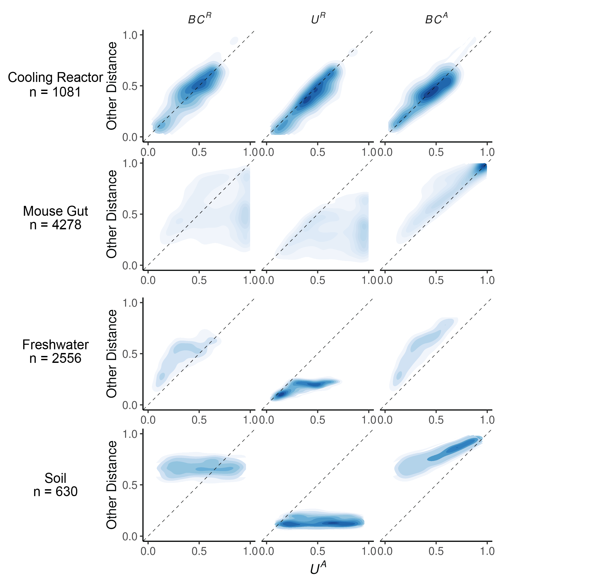

\singlespacing

```{r setup, include=FALSE}
knitr::opts_chunk$set(echo = FALSE, message = FALSE, warning = FALSE,
                      options(scipen=999
                              )
                      )
library(phyloseq)
library(tidyverse)
```

\newpage

## Interpretation and application of absolute abundance in Weighted UniFrac distance

Augustus Pendleton^1^\* & Marian L. Schmidt^1^\*

^1^Department of Microbiology, Cornell University, 123 Wing Dr, Ithaca, NY 14850, USA

**Corresponding Authors:** Augustus Pendleton: [arp277\@cornell.edu](mailto:arp277@cornell.edu){.email}; Marian L. Schmidt: [marschmi\@cornell.edu](mailto:marschmi@cornell.edu){.email}

**Author Contribution Statement:** Both authors contributed equally to the manuscript.

**Preprint servers:** This article was submitted to *bioRxiv* (doi: ) under a CC-BY-NC-ND 4.0 International license.

**Keywords:** Microbial Ecology - Beta Diversity - Absolute Abundance - Bioinformatics - UniFrac

**Data Availability:** All data and code used to produce the manuscript are available at <https://github.com/MarschmiLab/Pendleton_2025_Absolute_Unifrac_Paper>, in addition to a reproducible `renv` environment. All packages used for analysis are listed in Table S1.

\newpage

    The UniFrac distance was first introduced by Lozupone & Knight (2005), and has since become enormously popular as a measure of $\beta$-diversity within the field of microbial ecology [@lozupone2005]. A benefit of the UniFrac distance is that is considers phylogenetic information when estimating the distance between two communities. After first generating a phylogenetic tree representing species (or amplicon sequence variants, "ASVs") from all samples, the UniFrac distance computes the fraction of branch-lengths which is *shared* between communities, relative to the total branch length represented in the tree. UniFrac can be both unweighted, in which only the incidence of species is considered, or weighted, wherein a branch's contribution is weighted by the proportional abundance of taxa on that branch [@lozupone2007]. The weighted UniFrac is derived: $$
U^R=\frac{\sum_{i=1}^{n} b_i|p_i^a-p_i^b|}{\sum_{i=1}^{n} b_i(p_i^a+p_i^b)}
$$ where we weight the length of each branch, $b_i$, by the difference in the relative abundance of all species ($p_i$) descended from that branch in sample $a$ or sample $b$. Here, we denote this distance as *U^R^*, for "Relative Unifrac". Popular packages which calculate weighted Unifrac-including `diversity-lib` QIIME plug-in and the R packages `phyloseq` and `GUniFrac`-run this normalization by default.

    Because $U^R$ is most sensitive to changes in abundant lineages, it can sometimes obscure compositional differences driven by rare to moderately-abundant taxa [@chen2012]. To address this weakness, Chen et al. (2012) introduced the generalized UniFrac distance ($GU^R$), in which the impact of abundant lineages can be mitigated by decreasing the parameter $\alpha$: $$
GU^R=\frac{\sum\limits_{i=1}^{n} b_i(p_i^a+p_i^b)^\alpha\left|\dfrac{p_i^a-p_i^b}{p_i^a+p_i^b}\right|}{\sum\limits_{i=1}^{n} b_i(p_i^a+p_i^b)^\alpha}
$$

where $\alpha$ ranges from 0 (close to unweighted UniFrac) up to 1 (identical to $U^R$, above). However, if one wishes to use absolute abundances, both $U^R$ and $GU^R$ can be derived without normalizing to proportions:

$$
\begin{aligned}
U^A=\frac{\sum\limits_{i=1}^{n}b_i|c_i^a-c_i^b|}{\sum\limits_{i=1}^{n}b_i(c_i^a+c_i^b)}\qquad&&
GU^A=\frac{\sum\limits_{i=1}^{n}b_i(c_i^a+c_i^b)^\alpha\left|\dfrac{c_i^a-c_i^b}{c_i^a+c_i^b}\right|}{\sum\limits_{i=1}^{n}b_i(c_i^a+c_i^b)^\alpha}
\end{aligned}
$$

Where $c_i^a$ and $c_i^b$ stands for the absolute counts of species descended from branch $b_i$ in community $a$ and $b$, respectively. We refer to these distances as "Absolute Unifrac" and "Generalized Absolute Unifrac" ($U^A$ and $GU^A$) .

    There is growing recognition that microbial load matters, and methods for discerning absolute abundance like flow cytometry, qPCR, and genomic spike-ins are growing in popularity [@props2017; @wang2021]. These methods allow microbial ecologists to make more ecologically relevant conclusions; they relax the constraints sequencing imposes via compositionality, they capture absolute changes in functionally relevant taxa, and they can uncover dose-dependent effects driven by microbial load rather than composition [@gloor2017; @wang2021]. Previous metabarcoding studies using absolute abundance have generally used Bray-Curtis dissimilarity, which does not assume normalization to proportions [e.g. @props2017; @rao2021]. However, weighted UniFrac distance integrates differences in composition, phylogeny, *and* abundance, and so it is conceptually difficult to predict and interpret the impact of absolute abundance on this metric.

    To help clarify how $U^A$ should be interpreted, we began with a simulated community, represented by four ASVs with simple phylogenetic relationships (Fig. 1A). We assigned each ASV an absolute count of 1, 10, or 100, yielding 81 samples and 3240 cross-sample comparisons for which we calculate four distance metrics: Bray-Curtis using relative abundance ($BC^R$), Bray-Curtis using absolute abundance ($BC^A$), weighted Unifrac using relative abundance ($U^R$), and weighted Unifrac using absolute abundance ($U^A$) . We then calculated the difference in distance calculated by each metric compared to $U^A$; the distributions of these differences are shown in Fig. 1B.

    For all metrics, there are scenarios where $U^A$ estimates either greater or lesser distance (Fig. 1B). In the improbable scenario that all branch lengths are equal, $U^A$ will always be equal to or less than $BC^A$ (Fig. S1). We then isolated specific comparisons to illustrate where and when $U^A$ differs from other metrics (Fig. 1C). Scenario one (gold star) indicates the canonical benefit of UniFrac distances: the phylogenetic similarity of ASV_1 and ASV_2 allow $U^R$ and $U^A$ to discern greater similarity between samples than the phylogenetically-oblivious $BC^R$ and $BC^A$. Scenario two (red star) illustrates the importance of absolute abundances: $BC^R$ and $U^R$ perceive two communities as identical despite large differences in absolute abundance.

    At times, the incorporation of absolute abundance can also *decrease* the perceived dissimilarity (green star). Here, $BC^A$ and $U^A$ are both smaller than their relative counterparts, as half of the community is perceived as identical, despite differences in their relative abundances due to proportionality. Finally, $U^A$ is highly correlated with $BC^A$ (Pearsons $r$ = 0.82, $p$ \< 0.0001) compared to $BC^R$ ($r$ = 0.41) and $U^R$ ($r$ = 0.55), and usually less than $BC^A$ due to the effect described in Scenario one. However, there are scenarios in which $U^A$ is greater than $BC^A$ (blue star). Because the absolute differences are observed on longer branches relative to the rest of the tree, $U^A$ discerns greater distance than $BC^A$.

\begingroup \centering

{width="100%"}

\endgroup
\begingroup \fontsize{10}{12}\selectfont

*Figure 1. Simple simulations to compare the impact of absolute abundance on phylogenetic and non-phylogenetic distance measures.* (A) We created a small community represented by 4 ASVs. We explored all permutations of each ASV holding an absolute count of 1, 10, or 100 to create 81 communities, producing 3240 comparisons for which we calculated distance metrics. (B) Distributions of the difference between weighted Unifrac using absolute abundance ($U^A$), Bray-Curtis using relative abundance ($BC^R$), weighted Unifrac using relative abundance ($U^R$), and Bray-Curtis using absolute abundance ($BC^A$). (C) Scenarios (comparisons) highlighting occasions when $U^A$ is larger or lesser compared to other metrics. The stars indicate what region of the distributions in (B) this scenario would fall. The actual values for each metric are displayed beneath the scenario.

\endgroup

    We next explored the practical effect $U^A$ has on separating groups within a real dataset. We used a previously published 16S dataset from Lake Ontario, represented by 66 samples and \>7,000 ASVs, where samples clustered into three main groups defined by depth and month due to changes in both composition and abundance (Fig. S2, [@pendleton]). We sought to demonstrate how weighting by absolute abundance can affect the interpretation and statistical power to separate samples between these depth/month groups.

    We calculated the generalized absolute UniFrac ($GU^A$) across three levels of $\alpha$: 0.0 (close to unweighted UniFrac), 0.5, and 1.0 (identical to $U^A$). Fig. 2A shows PCoA ordinations of the same samples across this $\alpha$-range. As $\alpha$ increases, we see a greater recognition of similarity between Shallow September and Shallow May, reflecting their relatively higher cell counts compared to the Deep samples. Note that an increasing amount of variation is also assigned to the first axis, going from 18.3% up to 76.7%. This trend was also true for $U^R$ across multiple $\alpha$, but to a much weaker degree (Fig. S3).

    We used PERMANOVAs to quantify the variance ($R^2$) and statistical power ($F$-statistic) our three depth-month groups can explain across different distance metrics ($GU^R$, $GU^A$, $BC^R$ and $BC^A$) and different alpha values (Fig. 2B and 2C). Absolute abundance metrics consistently allow for greater $R^2$ values ($GU^A$ reaching a maximum of 75.8%) and F-statistics (1.56X higher for $GU^A$ than $GU^R$) than their relative counterparts. For UniFrac distances, this separation increases as alpha increases. As such, the incorporation of absolute abundances can be a powerful tool to emphasize differences in microbial load between groups.

    That said, we identify a major caveat; $U^A$ can become strongly correlated to the cell-counts alone compared to other distance metrics (Fig. 2D). We used a Mantel test to assess the correlation between each distance metric to the absolute difference in cell counts between each sample. Absolute abundance measures are more sensitive to differences in cell counts compared to their relative counterparts. This is intuitive, and to a degree, intentional; the utility of these metrics is to identify changes in absolute abundance even in the case of compositional similarity. However, at $\alpha$ = 1, the value of $U^A$ becomes almost entirely based on the overall abundance of a sample. We see this reflected in the ordinations as well; as $\alpha$ increases, the first Axis increasingly represents and correlates to the absolute abundance (Spearman's $\rho$ = -1.0 for $\alpha$ = 1.0 versus Spearman's $\rho$ = 0.58 for $\alpha$ = 0.0 versus ). It is possible that any 2D structure we observed in the third panel of Fig. 2A is simply the result of the horseshore effect [@morton2017].

    With this in mind, we encourage others to think critically about how heavily they want their distance metric to correspond to absolute abundance, and modulate this effect using $GU^A$ rather than $U^A$. As a simple start from these data, we recommended using an $\alpha$ value of 0.5, consistent with the original recommendation of Chen et al. (2012) but of heightened importance when using absolute abundances.

\begingroup \centering

{width="100%"}

\endgroup
\begingroup \fontsize{10}{12}\selectfont

*Figure 2. Impact of absolute abundance on separating freshwater microbial communities* (A) Samples represent microbial communities from Lake Ontario taken at different times (May and September) and at different depths (Shallow and Deep), as originally described in Pendleton et al. (2025). We used Principal Coordinates Analysis (PCoA) to ordinate samples based on the $GU^A$ at $\alpha$ values of 0.0, 0.5, and 1.0. The proportion of variance assigned to each axis is provided in brackets. Note that the x-axis is reversed in the first panel, to provide visual symmetry across ordinations. We then used PERMANOVAs to quantify the variance ($R^2$) (B) and statistical power ($F$-statistic) (C) our three depth-month groups can explain across different distance metrics ($GU^R$, $GU^A$, $BC^R$ and $BC^A$) and different alpha values. (D) Correlations between different distance metrics and differences in over-all cell abundances as assessed by a Mantel test.

\endgroup

    The incorporation of absolute abundance allows microbial ecologists to assess more realistic, ecologically-relevant differences in microbial communities in situations for where microbial load matters. For example, the temporal development of the infant microbiome is captured in both a rise in absolute abundance in addition to compositional changes [@rao2021]; bacteriophage predation in wastewater bioreactors can be understood only when incorporating microbial load [@shapiro2010]; and the negative impact of antibiotics on the abundance of specific taxa in the swine gut was missed using relative abundance approaches [@wagner2025]. As $\beta$-diversity metrics are an essential tool for every microbial ecologist-and UniFrac distances are highly popular within microbiome research specifically-we encourage other researchers to adopt the usage of $GU^A$ in comparing their samples.

    Our data show, however, that the interpretation of these metrics can be complex, and researchers should consider (and justify) the relative importance of absolute abundance in their estimates of $\beta$-diversity. We also do not address other concerns relevant to estimating $\beta$-diversity, including the impacts of sampling effort on richness and whether rarefaction should be applied when calculating $GU^A$ [@schloss2023]. As ever, interpreting the results of these metrics critically and exploring the sensitivity of your conclusions across multiple metrics is encouraged [@kers2022]. Through this work, we hope to facilitate the adoption of $GU^A$ and its interpretation in an approachable manner.

#### References
