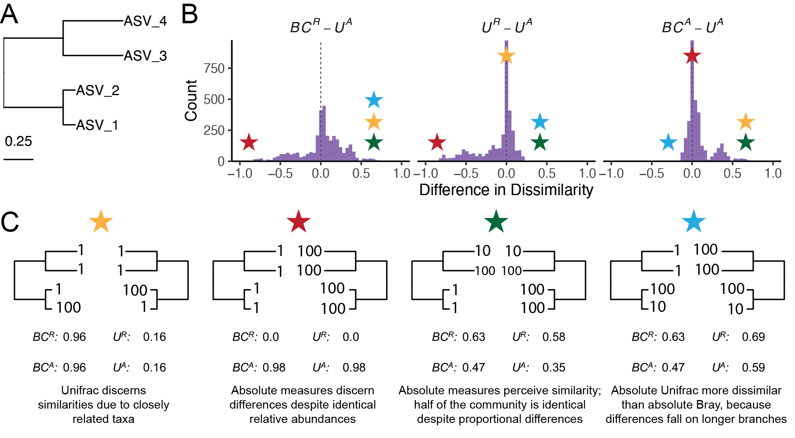

\singlespacing

\newpage

## Interpreting UniFrac with Absolute Abundance: A Conceptual and Practical Guide

Augustus Pendleton^1^\* & Marian L. Schmidt^1^\*

^1^Department of Microbiology, Cornell University, 123 Wing Dr, Ithaca, NY 14850, USA

**Corresponding Authors:** Augustus Pendleton: [arp277\@cornell.edu](mailto:arp277@cornell.edu){.email}; Marian L. Schmidt: [marschmi\@cornell.edu](mailto:marschmi@cornell.edu){.email}

**Author Contribution Statement:** Both authors contributed equally to the manuscript.

**Preprint servers:** This article was submitted to *bioRxiv* (doi: ) under a CC-BY-NC-ND 4.0 International license.

**Keywords:** Microbial Ecology - Beta Diversity - Absolute Abundance - Bioinformatics - UniFrac

**Data Availability:** All data and code used to produce the manuscript are available at <https://github.com/MarschmiLab/Pendleton_2025_Absolute_Unifrac_Paper>, in addition to a reproducible `renv` environment. All packages used for analysis are listed in Table S1.

\newpage

    Microbial ecologists routinely compare communities using $\beta$-diversity metrics derived from relative abundances. Yet this approach overlooks a critical ecological dimension: microbial load. High-throughput sequencing produces compositional data, in which each taxon’s abundance is constrained by all others [@gloor2017]. However, quantitative profiling studies show that cell abundance, not only composition, can drive major community differences [@vandeputte2017]. In low-biomass samples, relying on relative abundance can allow contaminants to appear biologically meaningful despite absolute counts too low for concern [@barlow2020].

    To overcome compositional constraints, researchers increasingly use flow cytometry, qPCR, and genomic spike-ins to quantify microbial load [@props2017; @wang2021]. These tools improve detection of functionally relevant taxa and mitigate the compositional constraints imposed by sequencing [@gloor2017; @vandeputte2017]. Most studies using absolute data have used Bray-Curtis dissimilarity, which does not necessarily expect normalization to proportions [e.g. @props2017; @rao2021]. But in the field of microbial ecology, UniFrac distances remain popular when working with relative abundance data. Here, we present *Absolute UniFrac*, a direct extension of Weighted UniFrac that incorporates total abundance, and evaluate its impact across simulated and real-world datasets.

    The UniFrac distance was first introduced by Lozupone & Knight (2005), and has since become enormously popular as a measure of $\beta$-diversity within the field of microbial ecology [@lozupone2005]. A benefit of the UniFrac distance is that is considers phylogenetic information when estimating the distance between two communities. After first generating a phylogenetic tree representing species (or amplicon sequence variants, "ASVs") from all samples, the UniFrac distance computes the fraction of branch-lengths which is *shared* between communities, relative to the total branch length represented in the tree. UniFrac can be both unweighted, in which only the incidence of species is considered, or weighted, wherein a branch's contribution is weighted by the proportional abundance of taxa on that branch [@lozupone2007]. The weighted UniFrac is derived: $$
U^R=\frac{\sum_{i=1}^{n} b_i|p_i^a-p_i^b|}{\sum_{i=1}^{n} b_i(p_i^a+p_i^b)}
$$ where we weight the length of each branch, $b_i$, by the difference in the relative abundance of all species ($p_i$) descended from that branch in sample $a$ or sample $b$. Here, we denote this distance as *U^R^*, for "Relative Unifrac". Popular packages which calculate weighted Unifrac-including `diversity-lib` QIIME plug-in and the R packages `phyloseq` and `GUniFrac`-run this normalization by default.

    Because $U^R$ is most sensitive to changes in abundant lineages, it can sometimes obscure compositional differences driven by rare to moderately-abundant taxa [@chen2012]. To address this weakness, Chen et al. (2012) introduced the generalized UniFrac distance ($GU^R$), in which the impact of abundant lineages can be mitigated by decreasing the parameter $\alpha$: $$
GU^R=\frac{\sum\limits_{i=1}^{n} b_i(p_i^a+p_i^b)^\alpha\left|\dfrac{p_i^a-p_i^b}{p_i^a+p_i^b}\right|}{\sum\limits_{i=1}^{n} b_i(p_i^a+p_i^b)^\alpha}
$$

where $\alpha$ ranges from 0 (close to unweighted UniFrac) up to 1 (identical to $U^R$, above). However, if one wishes to use absolute abundances, both $U^R$ and $GU^R$ can be derived without normalizing to proportions:

$$
\begin{aligned}
U^A=\frac{\sum\limits_{i=1}^{n}b_i|c_i^a-c_i^b|}{\sum\limits_{i=1}^{n}b_i(c_i^a+c_i^b)}\qquad&&
GU^A=\frac{\sum\limits_{i=1}^{n}b_i(c_i^a+c_i^b)^\alpha\left|\dfrac{c_i^a-c_i^b}{c_i^a+c_i^b}\right|}{\sum\limits_{i=1}^{n}b_i(c_i^a+c_i^b)^\alpha}
\end{aligned}
$$

Where $c_i^a$ and $c_i^b$ stands for the absolute counts of species descended from branch $b_i$ in community $a$ and $b$, respectively. We refer to these distances as "Absolute Unifrac" and "Generalized Absolute Unifrac" ($U^A$ and $GU^A$) .

    To illustrate how $U^A$ behaves, we constructed a simulated community of four ASVs arranged in a simple phylogeny (Fig. 1A). By varying the absolute abundance of each ASV (1, 10, or 100), we generated 81 samples and 3,240 pairwise comparisons. For each pair, we computed four dissimilarity metrics: Bray-Curtis with relative abundance ($BC^R$), Bray-Curtis with absolute abundance ($BC^A$), Weighted UniFrac with relative abundance ($U^R$), and Weighted UniFrac with absolute abundance ($U^A$).

    $U^A$ does not consistently yield higher or lower distances but instead varies depending on how abundance and phylogeny intersect (Fig. 1B). In the improbable scenario that all branch lengths are equal, $U^A$ is always less than or equal to $BC^A$ (Fig. S1). These comparisons emphasize that incorporating phylogeny and absolute abundance reshapes distance estimates in nontrivial ways.

    To better understand how these metrics diverge, we examined individual sample pairs (Fig. 1C). Scenario 1 (gold star) illustrates the classic advantage of UniFrac: ASV_1 and ASV_2 are phylogenetically close, so $U^R$ and $U^A$ discern greater similarity between samples than $BC^R$ and $BC^A$, which ignore phylogenetic structure. Scenario 2 (red star) highlights a limitation of relative metrics: two samples with identical relative composition but a 100-fold difference in biomass appear identical to $BC^R$ and $U^R$, but not to their absolute counterparts. In Scenario 3 (green star), incorporating absolute abundance decreases dissimilarity. $BC^A$ and $U^A$ are lower than their relative counterparts because half the community is identical in absolute terms, despite proportional differences. In contrast, Scenario 4 (blue star) shows that $U^A$ can increase dissimilarity relative to $BC^A$ when abundance differences occur on long branches, amplifying phylogenetic dissimilarity.

    Across all 3,240 pairwise comparisons, $U^A$ is usually smaller than and strongly correlated with $BC^A$ (Pearsons $r$ = 0.82, $p$ \< 0.0001) than with $BC^R$ ($r$ = 0.41) and $U^R$ ($r$ = 0.55), reflecting the effect illustrated in Scenario 1. However, exceptions like Scenario 4 show that $U^A$ can also yield larger distances than $BC^A$ when abundance differences occur on long branches. These scenarios demonstrate that $U^A$ integrates ecological realism by capturing differences in both lineage identity and total biomass.

\begingroup \centering

{width="100%"}

\endgroup
\begingroup \fontsize{10}{12}\selectfont

*Figure 1. Simulated communities reveal how absolute abundance affects phylogenetic and non-phylogenetic β-diversity measures.* (A) We constructed a simple four-ASV community with a known phylogeny and generated all permutations of each ASV having an absolute abundance of 1, 10, or 100, resulting in 81 unique communities and 3,240 pairwise comparisons. (B) Distributions of pairwise differences between weighted UniFrac using absolute abundance ($U^A$) and three other metrics: Bray-Curtis using relative abundance ($BC^R$), weighted UniFrac using relative abundance ($U^R$), and Bray-Curtis using absolute abundance ($BC^A$). (C) Example comparisons illustrating specific scenarios where $U^A$ yields greater or smaller dissimilarity than other metrics. Colored stars indicate where each scenario falls within the distributions shown in panel B. Actual values for each metric are displayed beneath each scenario.

\endgroup

    We next evaluated how $U^A$ influences group separation in a real-world dataset. Using a previously published 16S rRNA gene dataset from Lake Ontario, we analyzed 66 samples and \>7,000 ASVs. Samples clustered into three groups defined by depth and month, reflecting shifts in both taxonomic composition and microbial load (Fig. S2, [@pendleton]). Our goal was to determine whether weighting phylogenetic distances by absolute abundance enhances interpretability and statistical power to distinguish sample groups.

    We calculated generalized absolute UniFrac ($GU^A$) across three levels of $\alpha$: 0.0 (approximating unweighted UniFrac), 0.5, and 1.0 (equivalent to $U^A$). As $\alpha$ increased, PCoA ordinations revealed stronger similarity between Shallow May and Shallow September samples, reflecting their higher cell counts compared to the Deep samples (Fig. 2A). Notably, the proportion of variation explained by the first PCoA axis increased substantially with $\alpha$, going from 18.3% at $\alpha=0$ up to 76.7% $\alpha=1$. This trend was also true for $U^R$ across multiple $\alpha$, but to a much weaker degree (Fig. S3).

    To quantify the impact on group differentiation, we performed PERMANOVA across depth-month groupings using $GU^R$, $GU^A$, $BC^R$, and $BC^A$ at varying $\alpha$ (Fig. 2B–C). Across all metrics, incorporating absolute abundance increased both the proportion of explained variance ($R^2$) and the $pseudo-F$-statistic. $GU^A$ achieved a maximum $R^2$ of 75.8% and a $pseudo-F$-statistic 1.56× greater than $GU^R$, highlighting the ability of $GU^A$ to detect group differences driven by microbial load.

    However, a major caveat emerged: at high $\alpha$ values, $GU^A$ became strongly correlated with total cell count alone (Fig. 2D). Mantel tests showed that absolute distance metrics are much more sensitive to differences in cell counts than their relative counterparts. This is intuitive, and to a degree, intentional: these metrics aim to detect changes in biomass even when composition remains constant. Yet at $\alpha$ = 1, $U^A$ is nearly a proxy for sample biomass. In ordination space, this manifests as Axis 1 being almost perfectly correlated with absolute abundance (Spearman’s $\rho$ = -1.0), whereas at $\alpha$ = 0.0, the correlation is moderate ($\rho$ = 0.58). The structure observed in Fig. 2A at $\alpha$ = 1 may largely reflect a horseshoe effect [@morton2017], where a strong gradient (here, cell counts) becomes curved in ordination space, potentially distorting ecological interpretation.

    We urge careful calibration of $\alpha$ based on research goals, thereby mitigating this effect using $GU^A$ rather than $U^A$. Researchers should consider how much emphasis they want their dissimilarity metric to place on microbial load. In this dataset, we recommend an intermediate $\alpha$ of 0.5, consistent with prior guidance [@chen2012], but especially important when using absolute abundance data.

\begingroup \centering

{width="100%"}

\endgroup
\begingroup \fontsize{10}{12}\selectfont

*Figure 2. Absolute abundance sharpens ecological signal in freshwater microbial communities but increases sensitivity to biomass.* (A) Principal Coordinates Analysis (PCoA) of microbial communities from Lake Ontario, sampled in May and September at two depths (Shallow and Deep) [@pendleton]. Ordinations are based on generalized UniFrac with absolute abundance ($GU^A$) at $\alpha$ values of 0.0, 0.5, and 1.0. Variance explained by each axis is shown in brackets. The x-axis is reversed in the first panel to provide visual symmetry across ordinations. (B-C) Results of PERMANOVA analyses quantifying (B) variance explained ($R^2$) and (C) statistical power ($pseudo-F$-statistic) across depth-month groups for four distance metrics: $GU^R$, $GU^A$, $BC^R$, and $BC^A$, each evaluated at multiple $\alpha$ values. (D) Mantel correlations between each distance matrix and differences in cell abundances.

\endgroup

    The incorporation of absolute abundance allows microbial ecologists to assess more realistic, ecologically-relevant differences in microbial communities, especially in contexts where microbial load matters. For example, the temporal development of the infant microbiome invovles both a rise in absolute abundance and compositional changes [@rao2021]; bacteriophage predation in wastewater bioreactors can be understood only when microbial load is considered [@shapiro2010]; and antibiotic-driven declines in specific swine gut taxa were missed using relative abundance approaches [@wagner2025]. As $\beta$-diversity metrics (and UniFrac specifically) remain central to microbial ecology, we encourage researchers to adopt $GU^A$ when absolute abundance data are available. While demonstrated here with 16S rRNA data, the approach is generalizable to other marker genes or (meta)genomic features, provided absolute abundance estimates are available. In doing so, $GU^A$ offers not only a more grounded picture of lineage differences but also sensitivity to both biomass variation and phylogenetic depth, enabling detection of subtle yet ecologically meaningful shifts.

    That said, interpretation of $GU^A$ requires care. When biomass differences dominate, ordinations may largely reflect microbial load rather than lineage turnover, particularly at $\alpha$ = 1 and with long phylogenetic branches. In such cases, higher statistical power may come at the cost of biological nuance. We also do not address related concerns, such as how sequencing depth influences richness estimates or whether rarefaction should be applied before calculating $GU^A$ [@schloss2023]. As with any $\beta$-diversity study, researchers should interpret results critically, explore sensitivity across metrics, and justify their choice of $\alpha$ [@kers2022]. Our results suggest that an intermediate $\alpha$ value offers a practical compromise that balances sensitivity to biomass with robustness to overdominance by total load, especially when lineage turnover is also of interest. We anticipate that $GU^A$ will become an essential tool for microbiome researchers seeking to incorporate absolute abundance information into ecologically grounded beta diversity comparisons.

#### References
