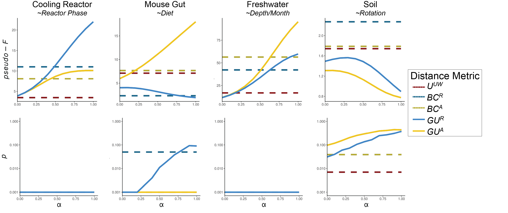
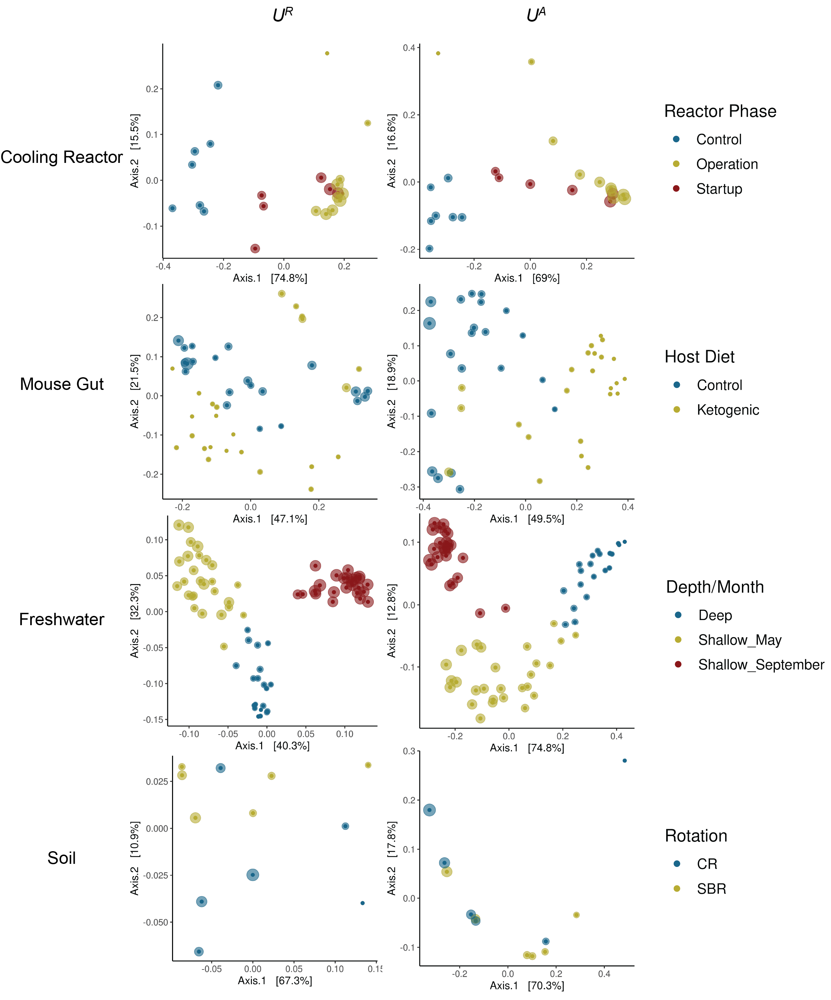

```{r setup, include=FALSE}
knitr::opts_chunk$set(echo = FALSE, message = FALSE, warning = FALSE, options(scipen=999))
```

## Interpretation and application of absolute abundance in Weighted UniFrac distance

Augustus Pendleton^1^\* & Marian L. Schmidt^1^\*

^1^Department of Microbiology, Cornell University, 123 Wing Dr, Ithaca,
NY 14850, USA

**Corresponding Authors:** Augustus Pendleton:
[arpt277\@cornell.edu](mailto:arp277@cornell.edu){.email}; Marian L.
Schmidt: [marschmi\@cornell.edu](mailto:marschmi@cornell.edu){.email}

\newpage

# Supplemental Figures


\singlespacing \begingroup
\fontsize{10}{12}\selectfont

*Figure S1. $U^A$ is always less than $BC^A$ when branch lengths are fully symmetrical.* (A) Symmetrical tree used for simulations as opposed to non-symmetrical tree in Fig. 1A. (B) Distribution of differences between $BC^A$ and $U^A$. As the differences are never negative, $U^A$ is always less than or equal to $BC^A$.

\endgroup \doublespacing

\newpage



\singlespacing \begingroup
\fontsize{10}{12}\selectfont

*Figure S2. Taxonomic composition and absolute abundance of microbial communities from Lake Ontario.* Each bar represents a sample taken from Lake Ontario. The height of the bar represents the absolute abundance (cells/ml) in each sample, filled at the Class level. Samples are clustered via hierarchical clustering (in this case, using UPGMA with $GU^A$, $\alpha$ = 0.05), reflecting both changes in composition (e.g. Cyanobacteriia in Shallow September, Anaerolineae in Deep) and absolute abundance (Deep samples have the fewest cell counts, follwoed by Shallow May and Shallow September).

\endgroup \doublespacing

\newpage



\singlespacing \begingroup
\fontsize{10}{12}\selectfont

*Figure S3. Principal Coordinates Analysis of Lake Ontario samples using $GU^R$ across three $\alpha$ values.*

\endgroup \doublespacing
